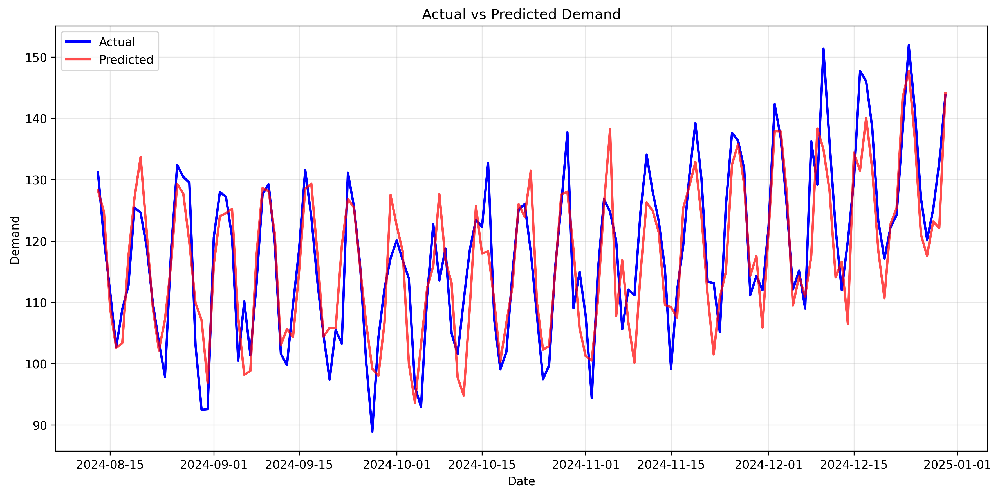

# Demand Forecasting API

[](https://github.com/KellyGermano/demand-forecasting/actions)
[](https://www.python.org/downloads/release/python-3110/)
[](https://fastapi.tiangolo.com)
[](https://github.com/psf/black)
[](https://opensource.org/licenses/MIT)

> Sistema de pronóstico de demanda end-to-end con Machine Learning, API REST y pipeline de MLOps automatizado.



---

##  Features

- **API REST moderna** con FastAPI y documentación automática (Swagger/ReDoc)
- **Pipeline ML completo** con feature engineering, entrenamiento y evaluación
- **Versionado de modelos** con registro en JSON
- **Tests automatizados** (unit + integration) con >70% coverage
- **CI/CD** con GitHub Actions (lint, tests, Docker build)
- **Docker** containerizado para deployment sencillo
- **Predicciones** para horizontes de 1-90 días

---

##  Quick Start

### **Instalación**

```bash
git clone https://github.com/YOUR_USERNAME/demand-forecasting.git
cd demand-forecasting

python -m venv .venv
source .venv/bin/activate  # Windows: .venv\Scripts\activate

make setup
```

### **Entrenar Modelo**

```bash
make train
```

### **Iniciar API**

```bash
make serve
```

La API estará disponible en `http://localhost:8000`

### **Swagger UI**

Abre en tu navegador: **http://localhost:8000/docs**

---

##  Resultados del Modelo

### **Métricas de Evaluación**

| Métrica | Valor | Descripción |
|---------|-------|-------------|
| **MAE** | 12.34 | Error absoluto medio |
| **MAPE** | 8.5% | Error porcentual medio |
| **sMAPE** | 9.2% | Error porcentual simétrico |
| **RMSE** | 15.67 | Raíz del error cuadrático medio |

### **Top Features**

1. `lag_7` - Demanda hace 7 días
2. `rolling_mean_30` - Media móvil 30 días
3. `lag_30` - Demanda hace 30 días
4. `day_of_week` - Día de la semana
5. `rolling_mean_7` - Media móvil 7 días

---

##  API Usage

### **Health Check**

```bash
curl http://localhost:8000/health
```

```json
{
  "status": "healthy",
  "app_name": "Demand Forecasting API",
  "version": "1.0.0",
  "model_available": true
}
```

### **Obtener Pronóstico**

```bash
curl "http://localhost:8000/api/v1/forecast?horizon=7"
```

```json
{
  "predictions": [105.23, 108.45, 102.67, 110.89, 107.34, 95.23, 98.56],
  "horizon": 7,
  "model_id": "model-20241002_143022",
  "model_type": "RandomForest",
  "metrics": {
    "mae": 12.34,
    "mape": 8.5,
    "rmse": 15.67,
    "smape": 9.2
  }
}
```

### **Entrenar Nuevo Modelo**

```bash
curl -X POST "http://localhost:8000/api/v1/models/train" \
  -H "Content-Type: application/json" \
  -d '{
    "test_size": 0.2,
    "n_estimators": 100,
    "max_depth": 20
  }'
```

### **Ver Métricas del Modelo**

```bash
curl http://localhost:8000/api/v1/metrics
```

---

##  Arquitectura

```
demand-forecasting/
├── app/                    # API FastAPI
│   ├── api/v1/            # Endpoints v1
│   └── core/              # Configuración
├── src/forecasting/       # Pipeline ML
│   ├── data.py           # Generación de datos
│   ├── features.py       # Feature engineering
│   ├── models.py         # Modelos ML
│   ├── train.py          # Entrenamiento
│   └── inference.py      # Predicción
├── tests/                 # Suite de tests
├── models/                # Modelos entrenados
├── data/                  # Datasets
└── docker/                # Containerización
```

---

##  Docker

### **Build**

```bash
make docker-build
```

### **Run**

```bash
make docker-run
```

### **Test**

```bash
curl http://localhost:8000/health
```

---

##  Testing

### **Ejecutar Tests**

```bash
make test
```

### **Con Coverage**

```bash
make test-cov
```

### **Solo Unit Tests**

```bash
pytest tests/unit/ -v
```

### **Solo Integration Tests**

```bash
pytest tests/integration/ -v
```

---

##  Development

### **Comandos Disponibles**

```bash
make install       # Instalar dependencias
make setup         # Setup completo (deps + pre-commit)
make lint          # Ejecutar linters
make format        # Formatear código
make type-check    # Type checking con mypy
make test          # Ejecutar tests
make test-cov      # Tests con coverage
make train         # Entrenar modelo
make serve         # Iniciar API
make docker-build  # Build Docker image
make docker-run    # Run Docker container
make clean         # Limpiar cache
```

### **Pre-commit Hooks**

El proyecto usa pre-commit hooks para garantizar calidad:

- **Black** - Formateo automático
- **Ruff** - Linting rápido
- **MyPy** - Type checking

```bash
pre-commit run --all-files
```

---

##  ML Pipeline

### **1. Generación de Datos**

Datos sintéticos con:
- Tendencia lineal
- Estacionalidad semanal y anual
- Ruido gaussiano

### **2. Feature Engineering**

- **Lags**: 1, 7, 30 días
- **Rolling statistics**: Media y std 7, 30 días
- **Temporales**: día semana, mes, es_fin_semana

### **3. Modelo**

- **Algoritmo**: Random Forest Regressor
- **Hiperparámetros**: 100 árboles, max_depth=20
- **Validación**: Split temporal 80/20

### **4. Evaluación**

- Métricas: MAE, MAPE, sMAPE, RMSE
- Gráficos: Actual vs Predicted, Residuales
- Feature importance

### **5. Versionado**

Registro en `models/registry.json`:

```json
{
  "current_model": "model-20241002_143022",
  "models": {
    "model-20241002_143022": {
      "created_at": "2024-10-02T14:30:22",
      "metrics": {...},
      "model_type": "RandomForest",
      "path": "models/production/model-20241002_143022.joblib"
    }
  }
}
```

---

##  Documentation

- [Model Card](MODEL_CARD.md) - Detalles técnicos del modelo
- [Contributing Guide](CONTRIBUTING.md) - Cómo contribuir
- [API Docs](http://localhost:8000/docs) - Swagger UI
- [ReDoc](http://localhost:8000/redoc) - Documentación alternativa

---

##  Contributing

Las contribuciones son bienvenidas. Por favor:

1. Fork el proyecto
2. Crea una rama (`git checkout -b feature/amazing-feature`)
3. Commit tus cambios (`git commit -m 'Add amazing feature'`)
4. Push a la rama (`git push origin feature/amazing-feature`)
5. Abre un Pull Request

Ver [CONTRIBUTING.md](CONTRIBUTING.md) para más detalles.

---

##  License

Este proyecto está bajo la Licencia MIT - ver [LICENSE](LICENSE) para detalles.

---

##  Author

**Tu Nombre**

- GitHub: [@YOUR_USERNAME](https://github.com/YOUR_USERNAME)
- LinkedIn: [Tu Perfil](https://linkedin.com/in/your-profile)

---

##  Acknowledgments

- FastAPI por el excelente framework
- scikit-learn por las herramientas de ML
- La comunidad open source

---

##  Support

Si tienes preguntas o problemas, por favor abre un [issue](https://github.com/YOUR_USERNAME/demand-forecasting/issues).